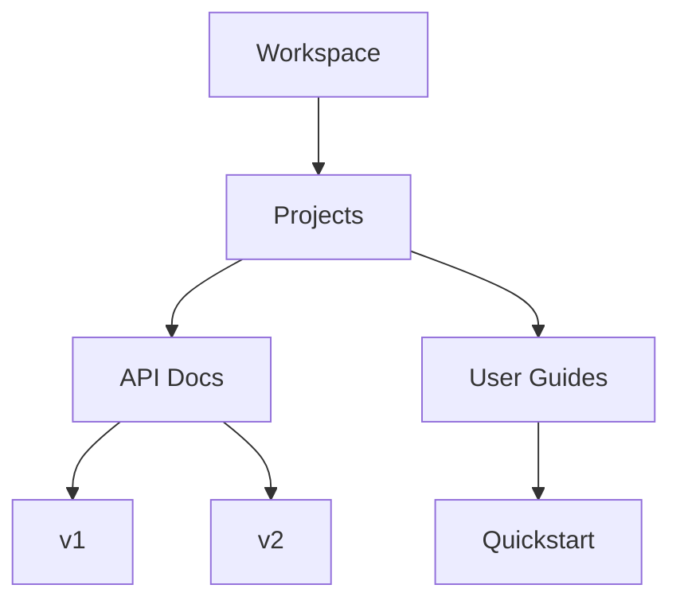

## Overview

Xeyla provides powerful tools to streamline your documentation workflow. You organize projects into intuitive folder structures, collaborate seamlessly with teams, edit rich content with advanced formatting, and locate information quickly using robust search capabilities. These core features ensure your docs stay current and accessible.

<Columns cols={2}>
  <Card title="Organize Projects" icon="folder" href="#project-organization">
    Structure your documentation with nested folders and smart tagging.
  </Card>
  <Card title="Collaborate Easily" icon="users" href="#collaboration">
    Share docs securely and track changes in real-time.
  </Card>
  <Card title="Edit with Power" icon="edit-3" href="#editing">
    Use familiar Markdown with live previews and embeds.
  </Card>
  <Card title="Search Smartly" icon="search" href="#search">
    Find content instantly across your entire workspace.
  </Card>
</Columns>

## Project Organization and Folders

Manage your documentation hierarchy effortlessly. Create nested folders to group related docs, apply tags for cross-project filtering, and use custom views to visualize structure.

<Steps>
  <Step title="Create a Folder" icon="folder-plus">
    Navigate to your workspace root. Click the `{New Folder}` button and name it `api-reference`.
  </Step>
  <Step title="Nest Documents" icon="folder">
    Drag docs into subfolders. For example, place `endpoints.mdx` under `api-reference/v1`.
  </Step>
  <Step title="Apply Tags" icon="tag">
    Select multiple docs and add tags like `deprecated` or `beta`.
  </Step>
</Steps>



<Callout kind="tip">
  Use folder prefixes like `{v1-}` or `{2024-}` for automatic sorting.
</Callout>

## Collaboration and Sharing Options

Invite team members and control access precisely. Share public links, set permissions, and monitor activity.

<Tabs>
  <Tab title="Team Invite" icon="users">
    Go to workspace settings. Add emails and assign roles: `admin`, `editor`, or `viewer`.
  </Tab>
  <Tab title="Public Sharing" icon="share-2">
    Select a doc, toggle `{Public Link}`. Customize with password protection.
  </Tab>
  <Tab title="Embed" icon="code">
    Generate embed code for your site:
    
````html
<iframe src="https://docs.xeyla.com/embed/project/123" width="100%" height="600"></iframe>
````
    
  </Tab>
</Tabs>

## Document Editing and Formatting

Edit docs with Markdown, MDX components, and rich previews. Insert images, code blocks, and interactive elements directly.

<CodeGroup tabs="Markdown,MDX">
```markdown
# Welcome

Use **bold** and _italics_. Add lists:

- Item 1
- Item 2
```
```mdx
## Interactive Docs

<Callout kind="info">
  This renders live!
</Callout>

<Image src="/screenshots/dashboard.png" alt="Dashboard overview" width="800" height="400" />
```
</CodeGroup>

<Expandable title="Advanced Formatting Tips" default-open="false">

Enable syntax highlighting with language tags:

````javascript
const apiKey = `YOUR_API_KEY`;
fetch(`https://api.example.com/docs`, {
  headers: { Authorization: `Bearer ${apiKey}` }
});
````

</Expandable>

## Search and Filtering Tools

Locate any doc instantly. Search by title, content, tags, or author. Filter results by folder, date, or status.

| Filter Type | Description | Example |
|-------------|-------------|---------|
| Full-Text | Matches keywords in content | `authentication token` |
| Tags | Filters by applied labels | `api`, `beta` |
| Folders | Scopes to specific paths | `projects/api/*` |
| Date Range | Recent changes only | Last 7 days |

<Callout kind="success">
  Pro tip: Use advanced queries like `{tag:api AND folder:reference}` for precise results.
</Callout>

These features integrate seamlessly, helping you maintain high-quality docs at scale. Start organizing your first project today.