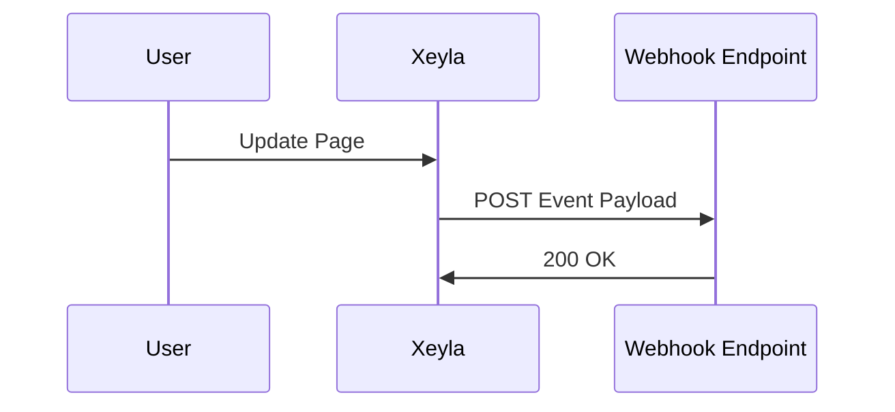

## Overview

Connect Xeyla to your favorite tools to automate documentation workflows, sync content from Git repositories, and trigger actions via webhooks. These integrations help you maintain up-to-date docs without manual effort.

<Columns cols={3}>
  <Card title="Git Sync" icon="git-branch" href="#git-import">
    Import and sync docs from GitHub, GitLab, or Bitbucket.
  </Card>
  <Card title="Third-Party Apps" icon="plug" href="#third-party">
    Connect Slack, Discord, and Zapier for notifications.
  </Card>
  <Card title="Webhooks" icon="zap" href="#webhooks">
    Set up custom automations with incoming webhooks.
  </Card>
</Columns>

## Third-Party App Connections

Xeyla supports seamless connections to popular tools. Start by navigating to the Integrations page in your dashboard at `https://dashboard.example.com/integrations`.

<Callout kind="info">
  Ensure you have admin access and a valid API key from [Authentication](/authentication).
</Callout>

Use the built-in app directory to authorize connections.

<Tabs>
  <Tab title="Slack" icon="message-circle">
    1. Select Slack from the app list.
    2. Authorize Xeyla to post in your workspace.
    3. Choose channels for doc update notifications.
  </Tab>
  <Tab title="Zapier" icon="zap">
    Trigger Zaps on doc publishes or comments.
    Use Xeyla as the trigger app in Zapier.
  </Tab>
</Tabs>

## Importing from Git Repositories

Sync your Markdown files directly from Git providers. This keeps your Xeyla space in sync with your repo.

<Steps>
  <Step title="Connect Repository" icon="git-branch">
    Go to Integrations > Git Sync. Select your provider (GitHub, GitLab, or Bitbucket).
  </Step>
  <Step title="Authorize Access" icon="key">
    Grant Xeyla read access to your repo using OAuth.
  </Step>
  <Step title="Configure Sync" icon="settings">
    Specify the branch (e.g., `main`), path (e.g., `docs/`), and sync interval (hourly, daily).
  </Step>
  <Step title="Import Content" icon="download">
    Trigger the initial import. Xeyla converts Markdown to native pages.
  </Step>
</Steps>

<CodeGroup tabs="GitHub,Bitbucket">
  ```yaml
  # .xeyla-sync.yml in your repo root
  sync:
    branch: main
    path: docs/
    interval: hourly
  ```
  ```yaml
  # .xeyla-sync.yml for Bitbucket
  sync:
    branch: master
    path: src/docs
    interval: daily
  ```
</CodeGroup>

## Exporting to Other Formats

Export your Xeyla content to PDF, HTML, or Markdown for external use.

<Tabs>
  <Tab title="PDF Export" icon="file-text">
    From any page, select Export > PDF. Customize with cover pages and themes.
  </Tab>
  <Tab title="Markdown Bundle" icon="code">
    Export entire spaces as ZIP with Markdown files and assets.
  </Tab>
</Tabs>

<Expandable title="Advanced Export API" default-open="false">
  Use the API for bulk exports.

  <Request tabs="cURL,JavaScript">
    ```bash
    curl -X POST https://api.example.com/v1/export \
      -H "Authorization: Bearer YOUR_XEYLA_API_KEY" \
      -H "Content-Type: application/json" \
      -d '{"spaceId": "spc_123", "format": "pdf"}'
    ```
    ```javascript
    const response = await fetch('https://api.example.com/v1/export', {
      method: 'POST',
      headers: {
        'Authorization': 'Bearer YOUR_XEYLA_API_KEY',
        'Content-Type': 'application/json'
      },
      body: JSON.stringify({
        spaceId: 'spc_123',
        format: 'pdf'
      })
    });
    ```
  </Request>
</Expandable>

## Webhooks and Automation Setup

Webhooks notify external services of events like page updates or publishes.

### Register a Webhook

```javascript
// Example payload for a page update event
{
  "event": "page.updated",
  "spaceId": "spc_123",
  "pageId": "pg_456",
  "timestamp": 1699123456,
  "changes": {
    "title": "Updated Docs",
    "path": "/integrations"
  }
}
```

<ParamField path="spaceId" param-type="string" required="true">
  Your Xeyla space identifier.
</ParamField>

<ParamField header="Xeyla-Signature" param-type="string" required="false">
  HMAC signature for payload verification using your webhook secret.
</ParamField>



<Callout kind="tip">
  Test webhooks in the dashboard before production use. Verify signatures to prevent spoofing.
</Callout>

These integrations make Xeyla a central hub for your documentation ecosystem. Explore more in [Quickstart](/quickstart).