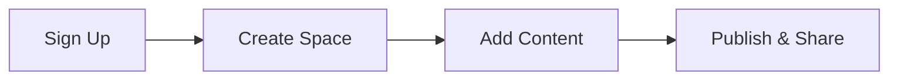

## Prerequisites

Before you begin, ensure you have:

- A modern web browser like Chrome, Firefox, or Safari
- An email address for account verification
- Optional: A GitHub account for version control integration

<Callout kind="info">

Xeyla works best with JavaScript enabled. Disable any ad blockers that might interfere with the dashboard.

</Callout>

## Create Your Account

Follow these steps to sign up and log in to Xeyla.

<Steps>
  <Step title="Visit the Dashboard" icon="globe">
    Open your browser and navigate to `https://dashboard.example.com`.
  </Step>
  <Step title="Sign Up" icon="user-plus">
    Click **Sign Up** and enter your email, password, and full name. Accept the terms of service.
  </Step>
  <Step title="Verify Email" icon="mail">
    Check your inbox for a verification email from Xeyla. Click the link to activate your account.
  </Step>
  <Step title="Log In" icon="log-in">
    Return to the dashboard and log in with your credentials. You land on the main workspace.
  </Step>
</Steps>

## Create a New Documentation Space

Organize your projects by creating dedicated spaces.

<Steps>
  <Step title="Click New Space" icon="plus">
    In the sidebar, select **New Space**.
  </Step>
  <Step title="Configure Space" icon="settings">
    Enter a name like `My Project Docs`, add a description, and choose visibility (public or private).
  </Step>
  <Step title="Customize Settings" icon="sliders">
    Set brand color to `#3B82F6` and enable features like search and analytics.
  </Step>
  <Step title="Save and Enter" icon="check-circle">
    Click **Create**. Your new space opens with a welcome page.
  </Step>
</Steps>

## Add Initial Content

Populate your space with pages using Markdown or MDX.

<Tabs>
  <Tab title="Markdown Page" icon="file-text">
    Create a simple Markdown file.

    ````markdown
    # Welcome to My Project

    This is your first documentation page.

    ## Features

    - Fast setup
    - Real-time collaboration
    - Version history
    ````

  </Tab>
  <Tab title="MDX Page" icon="code">
    Use MDX for interactive components.

    ````mdx
    ---

    title: Interactive Guide

    ---

    ## Quick Start

    <Callout kind="tip">Start editing now!</Callout>
    ````

  </Tab>
</Tabs>

<Callout kind="tip">

Save your page with `Ctrl+S` (`Cmd+S` on macOS) to publish changes instantly.

</Callout>

## Basic Interface Tour

Familiarize yourself with the key areas.

<Columns cols={3}>
  <Card title="Sidebar" icon="menu" href="#sidebar">
    Navigate spaces, pages, and settings.
  </Card>
  <Card title="Editor" icon="edit-3" href="#editor">
    Write in real-time Markdown/MDX editor with live preview.
  </Card>
  <Card title="Preview" icon="eye" href="#preview">
    See rendered output with components and syntax highlighting.
  </Card>
</Columns>

## Next Steps

Explore more features to enhance your documentation.

<Columns cols={2}>
  <Card title="Authentication" icon="shield" href="/authentication">
    Secure your spaces with API keys and OAuth.
  </Card>
  <Card title="Advanced Configuration" icon="settings" href="/configuration">
    Customize themes, integrations, and workflows.
  </Card>
</Columns>



Your Xeyla setup is complete. Start documenting your projects today!